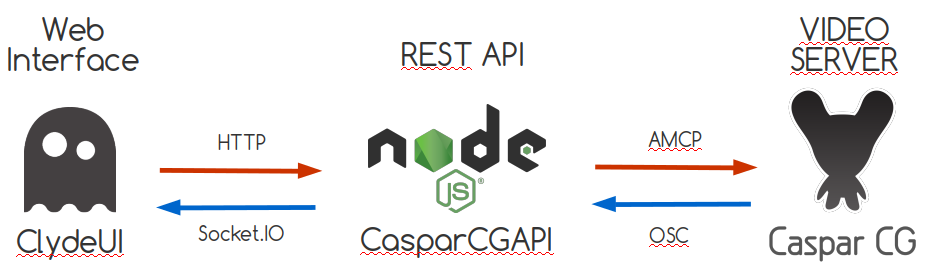

# Welcome to our ClydeUI project ! 

ClydeUI is a web interface for [CasparCG](http://casparcg.com/). It uses the [CasparCGAPI](https://github.com/M2I-Group-CasparCG/CasparCGAPI) backend. 
ClydeUI aims to offer a new way to use the playout server. Its main functionnalities are :
  * Scalable multiview channel
  * Easy input/output configuration
  * Multi-servers support
  * Switch bar with program/preview mode
  * Down stream keyers
  * Media Players
  * Recorder



## Installation guide


### Prerequisites

Before going further, make sur that you have both [NodeJS](https://nodejs.org/en/) and [npm](https://www.npmjs.com/) installed on your system. 

We worked with the version 9 of NodeJS but all the other recent versions should work. 

You can download NodeJS by clicking on the following links :

  * [Linux based systems](https://nodejs.org/en/download/package-manager/).
  * [Windows systems](https://nodejs.org/en/download/).

Once the installation done, make sure everything is reading :

```
  node -v
  npm -v
```

### CasparCG Installation

1. Download the CasparCG Server 2.1.0 Beta 1 for Windows version [here](http://casparcg.com/download.html).

> Why a beta version ?
>
> The stable version of CasparCG is very limited regarding the osc informations available. With the latest stable version, it would be impossible to get some very usefull informations like the currently playling file time, the recording time, etc.


2. Edit the CasparCG configuration file in order to :
  * Have a least 3 channels
  * Have a predefined OSC client matching with the server on which you run the API (localhost).
  * If you need it, a demo configuration file is available [here](https://github.com/M2I-Group-CasparCG/CasparCGAPI/blob/master/utilities/API/caspar.config).

3. Launch CasparCG server


### API installation

1. Download the API sources
    ```bash
    git clone https://github.com/M2I-Group-CasparCG/CasparCGAPI.git
    ```
    Or manually download the archive [here](https://github.com/M2I-Group-CasparCG/CasparCGAPI.git).
2. install the depedencies
    ```bash
    cd CasparCGAPI

    npm install
    ```
3. once everything is installed, just run the API 
    ```bash
    npm start 
    ```

4. You should know see the current message in the nodeJS prompt :
    ```bash
    udp server listening on 0.0.0.0:5253
    Express server listening on port 3000
    ```

### ClydeUI installation

1. Download ClydeUI sources
    ```bash
    git clone https://github.com/M2I-Group-CasparCG/ClydeUI.git
    ```
    
    Or manually download the archive [here](https://github.com/M2I-Group-CasparCG/ClydeUI.git).
2. Install the depedencies
    ```bash
    cd CasparCGAPI

    npm install
    ```
